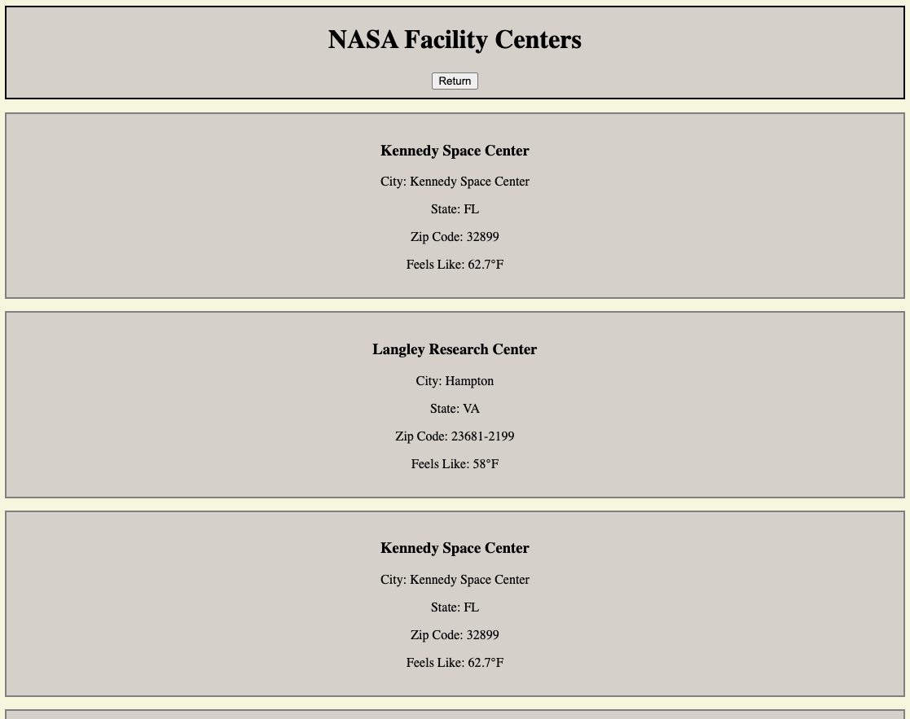

# NASA Facility Weather Tracker

A simple application that displays NASA facility locations and their current weather conditions using HTML, CSS, and JavaScript.

## About

This application retrieves NASA facility data and displays information for approximately 400 locations across the United States.

The project uses NASA's API to retrieve each facility's name, location, latitude, and longitude. The coordinates returned from NASA are then used to make a second API request to retrieve the current weather conditions at each facility.

## Screenshot

## Built With

- HTML
- CSS
- JavaScript
- NASA API
- Open-Meteo API

## How It Works

1. NASA's API returns facility information.
2. The application retrieves the latitude and longitude for each facility.
3. Those coordinates are passed into the Open-Meteo API.
4. Open-Meteo returns the current weather for that location.
5. The facility information and weather are displayed together on the page.

## What I Practiced

- Fetching data from multiple APIs
- Using data from one API in a second API request
- Working with JSON data
- Using latitude and longitude in API requests
- Working with arrays and `forEach()`
- DOM manipulation
- Dynamically creating elements
- Displaying API results on the page
- Handling asynchronous API requests